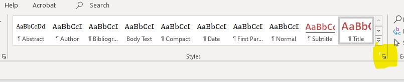
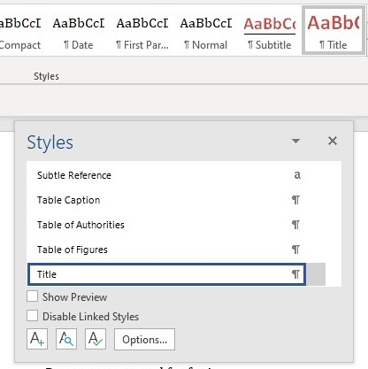

```{r setup, include=FALSE}
knitr::opts_chunk$set(echo = TRUE)
library(base)
library(magrittr)
library(readxl)
library(knitr)
library(babynames) 
library(dplyr) 
library(tidyverse)
library(ggplot2)
library(gridExtra)

```
```{r external, echo=FALSE}

read_chunk('Basic R Code.R')

```

## R Markdown Introduction

`rmarkdown` allows you to create documents directly from your R Code. Using either "chunks" or "in-line" R code, `rmarkdown` allows users to document their analysis, share R code and results with colleagues and even publish a professional document for end users all within the same document. An `rmarkdown` file can be converted (knitted) out to a number of different formats including HTML, PDF and Word.

For more details on using R Markdown see <http://rmarkdown.rstudio.com>.

R works best when take advantage of multiple packages and R Markdown is no exception. `knitr` is a package worth exploring as it allows the R Markdown `rmarkdown` to be converted to different document types. `rmarkdown` takes advantage of this relationship and knowing more about Knitr will help make your rendered documents that much better.


## Data Review {.tabset}
### Babynames
The `babynames` data set is provided by the SSA and contains US baby names with at least 5 uses.

```{r echo=FALSE}
kable(head(babynames))

```
### Pharma
Fabricated data modeled to look like real pharmacy claim data


```{r table2, echo=FALSE}

```


## Key R Markdown Functions and Uses

As with any R package there are too many functions and interesting code to talk about them all. However, a few things that `rmarkdown` does caught our attention and those are the items we will be discussing.

1.    Formatting
      *   Text
      *   Word Template
1.    Chunks
1.    External R Code


### Formatting
#### Text

`rmarkdown` is at it's core a markup language that allows methods for creating documents with headers, images, links etc. 

Here are a few common formatting commands:

Who doesn't like lists?! Also, comes in the Ordered variety (see above) \
Bold and Italics are among numerous formatting offered in `rmarkdown` \

**Code Snippet**
```
*   Un-ordered list item
	 +   *Italic* 
	 +   **Bold** 
```
**Output**

*   Un-ordered list item
	 +   *Italic*
	 +   **Bold**
	    
-----

Wrapping text in backquote (`) will highlight the selection which is great for highlighting R code.

**Code Snippet**
```
This is the R code to find out more about the rmarkdown word_document function
`?rmarkdown::word_document\`

```
**Output**

This is the R code to find out more about the rmarkdown word_document function `?rmarkdown::word_document`

-----

Headers are important for any document and using the hashtag will create different headers

**Code Snippet**
```
###### Header 1
####### Header 2
```

**Output**

##### Header Example 1 {.unlisted .unnumbered}

###### Header Example 2 {.unlisted .unnumbered} 

-----

Linking to to websites or other documents is a great way to keep users informed and engaged.

**Code Snippet**
```
R is the Best! <http://rmarkdown.rstudio.com>
```

**Output**

R is the Best! <http://rmarkdown.rstudio.com>

-----

You can even insert mathematical equations to help illustrate your point:

**Code Snippet**
```
$$\begin{array}{ccc}
x_{11} & x_{12} & x_{13}
x_{21} & x_{22} & x_{23}
\end{array}$$`
```

**Output**
$$\begin{array}{ccc}
x_{11} & x_{12} & x_{13}\\
x_{21} & x_{22} & x_{23}
\end{array}$$


-----

#### Word Template
`rmarkdown` is great for rendering to an HTML doc, but what about Word? Some of the markup tags work in Word , but most do not. Plus, what about all the great formatting functionality in Word? Well, with a little code in the YAML header we can have our `rmarkdown` rendered to a custom word template with the formatting already setup.

Adding this to the YAML header will tell `knitr` to use the pre-built template

```
output:
   word_document:
   reference_docx: RMarkdown_Template.docx
```

1.    First you need to generate a Word Document from an `rmarkdown` file. 
1.    Then open the word doc and expand the Style section in the Ribbon
1.    Save the template and reference with the code above





-----




This video was really helpful: <https://vimeo.com/110804387>, or check out the article at <https://rmarkdown.rstudio.com/articles_docx.html>

### Chunks
Chunks are one of the mainstays of `rmarkdown`. This function of r markdown allows users to quickly and easily switch between plain text and and r code that they would like to be executed.By doing so, users can organize complex code and test individual chunks without running their entire process. Additionally, the chunks have their own built-in functionality that allow the author to do things like reference the chunks by name later in the script, publish the code behind the chunk when Knitting out to another format, and much more. As an example, the following graphs (which display name frequency by sex and year) are actually the product of two chunks. The first, which we created to be invisible to the end user, runs the data and creates the charts. The second chunk calls and displays those charts neatly without the noise of the r code that precedes it.


```{r baby plots1, include=FALSE}

g1 <- babynames %>%
  filter(name=="Nora") %$% 
  ggplot(., aes(year, n)) +
  geom_line(aes(color=sex), lwd=1) +
  scale_color_manual(values = c("firebrick1", "dodgerblue")) +
  theme_bw() +
  ggtitle("Nora")

g2 <- babynames %>%
  filter(name=="Shawn") %$% 
  ggplot(., aes(year, n)) +
  geom_line(aes(color=sex), lwd=1) +
  scale_color_manual(values = c("firebrick1", "dodgerblue")) +
  theme_bw() +
  ggtitle("Shawn")

g3 <- babynames %>%
  filter(name=="Randall") %$% 
  ggplot(., aes(year, n)) +
  geom_line(aes(color=sex), lwd=1) +
  scale_color_manual(values = c("firebrick1", "dodgerblue")) +
  theme_bw() +
  ggtitle("Randall")

g4 <- babynames %>%
  filter(name=="Frances") %$% 
  ggplot(., aes(year, n)) +
  geom_line(aes(color=sex), lwd=1) +
  scale_color_manual(values = c("firebrick1", "dodgerblue")) +
  theme_bw() +
  ggtitle("Frances")

```


```{r babynames, echo=FALSE}

grid.arrange(g1,g2,g3,g4,ncol=2)
  
```

### External R Code
`rmarkdown` can be picky when trying to cut and paste existing R code. If you have a complicated R script or even just want to insert a graph. You can use the `## @knitr <your variable>` syntax you can create chunks in an external R script and call that chunk within the `rmarkdown` chunk header.


```{r table1, echo=TRUE}


```


```{r plot1, echo=FALSE}

```  

## R Markdown Challenges and Suggestions  

`rmarkdown` is not without challenges. We found the list formatting especially tedious, you have to get the spacing just right. The HTML and Word outputs behaved differently and it took a lot of research to figure out what worked best for both or to find a workaround. For those of us that don't use R regularly, it can take some time to align on which documents the `rmarkdown` references in the code. For example, without proper documentation it would be difficult to identify that one needs multiple supporting files in order to get this script to execute and knit out to Word or HTML appropriately.  

One Suggestion for a future `rmarkdown` version might be to include the capability for underlined text. Oddly enough, it is not currently an option. There is a workaround, but it is not technically part of the `rmarkdown` package right now. Another suggestion that speaks to a challenge we had might be the ability to format external documents that are referenced so that a new reader new reader can easily identify them. A function that would automatically call these objects and reference them in the YAML would be helpful as well.  


## Summary  

As evidenced by the documentation requirements for this project, as well as the native `rmarkdown` features built into R Studio, this package is becoming a cornerstone of the R language. The ability to quickly, neatly, and professionaly translate raw R code to a readable document that is easy to share is invaluable. Previously, a challenge for users of R in general as the limited number of ways to share finding and outputs. Reporting to non-developers could sometimes be challenging depending on the complexity of the work. `rmarkdown`'s value really is in its ability to bridge the gap between developer and end-user.


